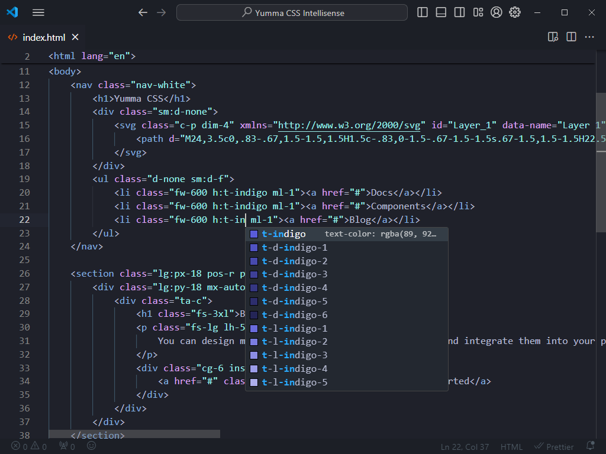
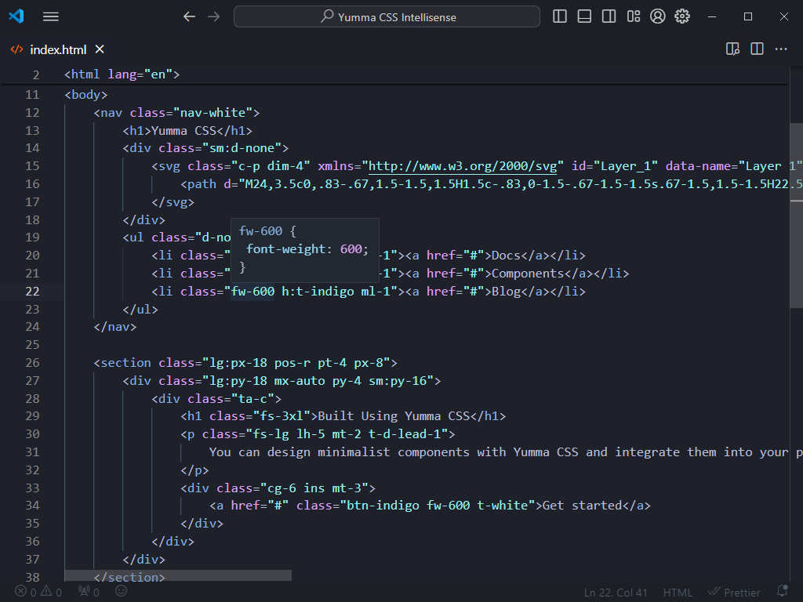

Today I'm very pleased to announce the arrival of the [Yumma CSS Intellisense extension for Visual Studio Code](https://marketplace.visualstudio.com/items?itemName=yumma-css.yumma-css-intellisense), designed by developers for developers to improve productivity and make creating applications or websites easier and more enjoyable.

{/* truncate */}

## What's in the box?

Here it is some features packaged with the extension:

- [x] **Completions:** Helpful completions that can be accessed while typing.
- [x] **Documentation**: Provides users with the opportunity to learn more about each completion.
- [x] **Hoverings:** Inspect the CSS behind the Yumma CSS classes.

Get [Yumma CSS Intellisense from the Visual Studio Marketplace](https://marketplace.visualstudio.com/items?itemName=yumma-css.yumma-css-intellisense).

---

### Completions

Get suggestions as you type, with information about their CSS properties and previews of the colors.

### Documentation

### Hoverings

Move your cursor over the name of a class to see each of its CSS properties.

