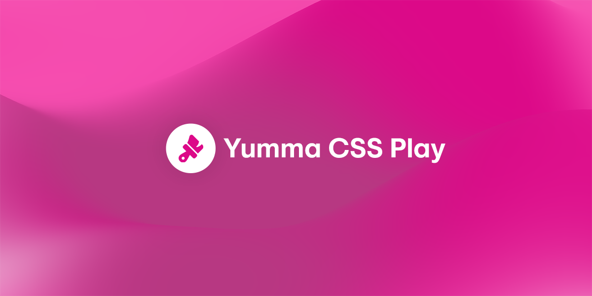

import Showcase from "@site/src/components/showcase/showcase";

I'm super happy to announce [Yumma CSS Play](https://play.yummacss.com)! This new and improved version allows you to build your own Yumma CSS components on the web and **preview** them on the fly without any extra setup.

{/* truncate */}

Yumma CSS Play is based on the [Monaco Editor](https://microsoft.github.io/monaco-editor/), which serves as the foundation for [Visual Studio Code](https://code.visualstudio.com/). This integration enables developers to prototype and **preview** interface components without the need to install additional packages.

---

## Community

Become a member of the Yumma CSS community, share your experiences and help Yumma CSS to grow tall and powerful.

<Showcase
  data={[
    {
      description: "If you experience any problems, please notify us at GitHub.",
      href: "https://github.com/yumma-lib/yumma-css/issues",
      icon: require("@site/static/img/icon/github.png").default,
      title: "GitHub"
    },
    {
      description: "Join our Discord for discussion, sharing, and learning.",
      href: "https://discord.gg/2MUw2g6FCn",
      icon: require("@site/static/img/icon/discord.png").default,
      title: "Discord"
    },
    {
      description: "Please follow us on Twitter to receive the latest updates.",
      href: "https://twitter.com/yummacss",
      icon: require("@site/static/img/icon/twitter.png").default,
      title: "Twitter"
    }
  ]}
/>