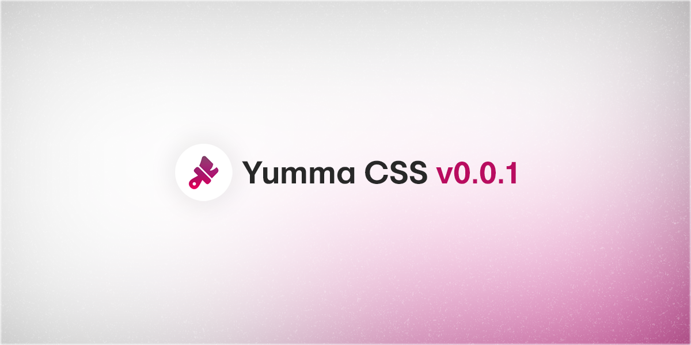

I'm happy to say that [Yumma CSS 0.0.1](https://github.com/yumma-lib/yumma-css/releases/tag/v0.0.1) is out now!

<!-- truncate -->



This release marks the first version of Yumma CSS. Check out the [latest version](/docs/installation).

### Get this release:

```bash
npm i yummacss@v0.0.1
```