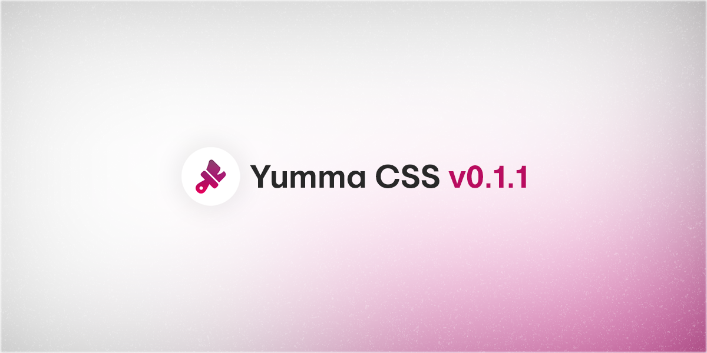

I'm happy to say that [Yumma CSS 0.1.1](https://github.com/yumma-lib/yumma-css/releases/tag/v0.1.1) is out now!

<!-- truncate -->



This is an easy-to-install update that focuses on fixes and improvements. Patch releases follow [Semantic Versioning](https://docs.npmjs.com/about-semantic-versioning) conventions.

### Get this release:

```bash
npm i yummacss@v0.1.1
```

### Here's what's new:

- Improved utility class generation for Height, Margin, Padding, and Width.
- Added new classes and selectors for Height, Margin, Padding, and Width properties.
- Replaced the `copyStyles` function with `minifyStyles` for faster CDN loading.