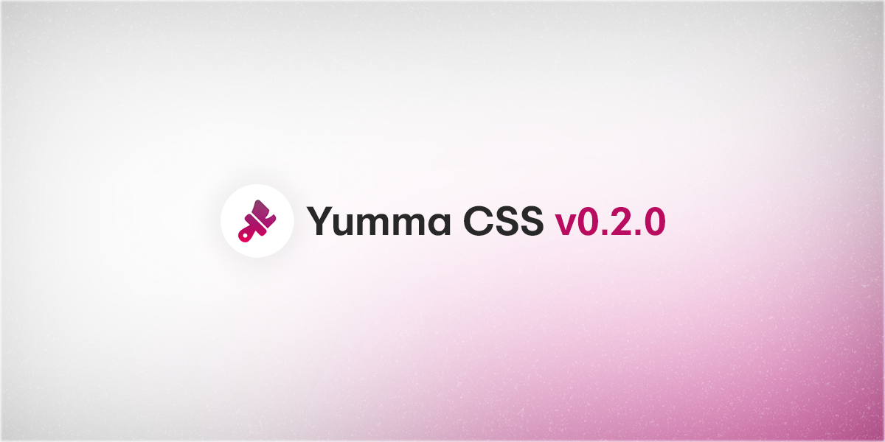

I'm happy to say that [Yumma CSS 0.2.0](https://github.com/yumma-lib/yumma-css/releases/tag/v0.2.0) is out now!

<!-- truncate -->



This is an incremental update that may contain bug fixes. Minor releases follow the conventions of [Semantic Versioning] (https://docs.npmjs.com/about-semantic-versioning). In other words, this should be an easy update for you.

### Get this release:

```bash
npm i yummacss@v0.2.0
```

### Here's what's new:

- Added the `!default` flag to variables and maps in the `_variables.scss` file.