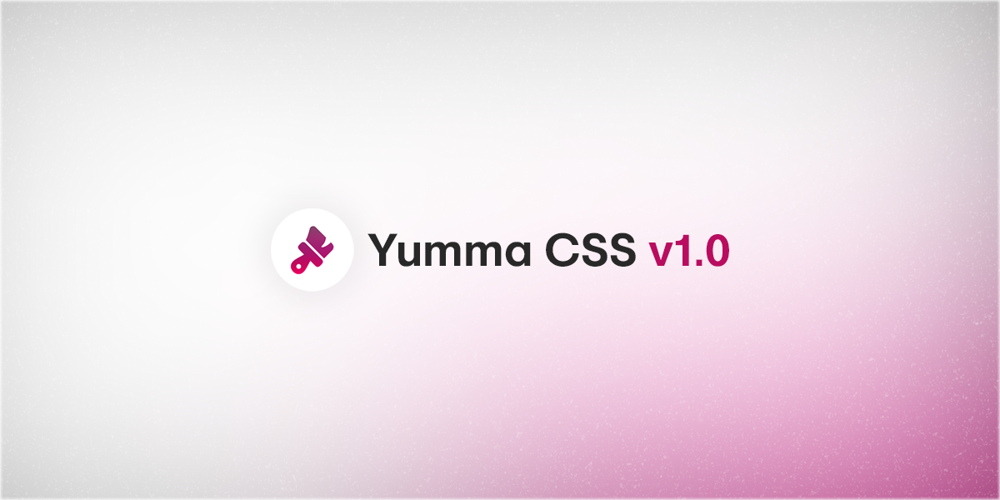

After a few months of development, I am releasing for the first time ever the first major release. Be welcome — [Yumma CSS v1.0.0](https://github.com/yumma-lib/yumma-css/releases/tag/v1.0.0).

<!-- truncate -->



This is a highly significant update that introduces breakthrough features. Major releases follow [Semantic Versioning](https://docs.npmjs.com/about-semantic-versioning) conventions.

### Get this release:

```bash
npm i yummacss@v1.0.0
```

### Here's what's new:

- Added `flow-root` property to **Display** classes.
- Added `inline-start` and `inline-end` properties to **Float** classes.
- Added `justify-all` and `match-parent` properties to **Text Align** classes.
- Added `overline` property to **Text Decoration Line** classes.
- Added `flex-start` and `flex-end` properties to **Align Items** classes.
- Added `end`, `flex-start`, `flex-end`, `left`, `right`, `normal` and `stretch` properties to **Justify Content** classes.
- Added `.mx` and `.my` **Margin** classes.
- Added `.px` and `.py` **Padding** classes.
- Added viewport values for **Height** and **Width** classes.
- Added the color `lead` in the Color Palette.
- Added **Align Content** classes.
- Added **Align Self** classes.
- Added **Flex Basis** classes.
- Added **Flex Grow** classes.
- Added **Grid Auto Columns** classes.
- Added **Grid Auto Flow** classes.
- Added **Grid Auto Rows** classes.
- Added **Justify Items** classes.
- Added **Justify Self** classes.
- Added **Cursor** classes.
- Added **List Style Type** classes.
- Added **Appearance** classes.
- Added **Pointer Events** classes.
- Added **User Select** classes.
- Added **Caret Colors** classes.
- Added **Font Family** classes.
- Added **Text Decoration** classes.
- Updated display class syntax from `dis-[value]` to `d-[value]`.
- Updated hover state class syntax from `[value]-h-[value]` to `h:[value]`.
- Updated `greet()` function name to `showVer()`.
- Color palettes now use RGB.
- Small CSS resetting improvements.
- Removed `break-all` and `keep-all` properties from **Overflow Wrap** classes.
- Removed duplicate classes for **Justify Content** classes.
- Removed class `nav-l` from `_navbar.scss`.