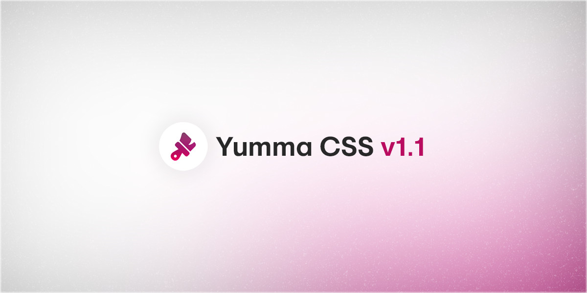

import ClassList from '@site/src/components/ClassList/ClassList';
import ClassPreview from '@site/src/components/ClassPreview/ClassPreview';

import Tabs from '@theme/Tabs';
import TabItem from '@theme/TabItem';

This update will not introduce any significant new features as it's more focused on small necessary improvements, utility syntax changes and small increments, but anyway here it is — [Yumma CSS v1.1](https://github.com/yumma-lib/yumma-css/releases/tag/v1.1.0).

{/* truncate */}

This is an incremental update that may contain bug fixes. Minor releases follow the conventions of [semantic versioning](https://docs.npmjs.com/about-semantic-versioning). In other words, this should be an easy update for you.



## What's new?

These are the top features:

- [x] **[Button transition](#new-button-animations):** New button component animations.

- [x] **[Font sizes](#font-sizes):** New variant for font sizes.

- [x] **[New `dim-*`](#new-dim--utilities):** New utilities for setting height and width simultaneously.

- [x] **[Utility syntax changes](#utility-syntax-changes):** Changing syntax for Box Shadow, Column and List Style Type utilities.

Bet you know this already, but I'll say it again. If you want to see all the fixes and improvements, head over to the [release notes](https://github.com/yumma-lib/yumma-css/releases/tag/v1.1.0), where you can see basically every single detail of what's changed.

---

### Button transition

<Tabs>
  <TabItem value="now" label="Now">
    <ClassPreview
      codeData={`
        <div class="ins mt-6">
          <button class="btn-pink t-white">Button</button>
        </div>
      `}
      isPadded = {false}
      isCentered = {false}
      isVersion = '1.1.0'
    />
  </TabItem>
  <TabItem value="then" label="Then">
    <ClassPreview
      codeData={`
        <div class="ins mt-6">
          <button class="btn-pink t-white">Button</button>
        </div>
      `}
      isPadded = {false}
      isCentered = {false}
      isVersion = '1.0.0'
    />
  </TabItem>
</Tabs>

---

### Font sizes

I'm going to implement a new class for font sizes in Yumma CSS 1.1, in this case and to be more specific a variant for the utility - `fs-xs`.

<ClassList
  classData={[
    {
      className: 'fs-xs',
      properties: [
        'font-size: 0.6rem;'
      ]
    }
  ]}
/>

---

### New `dim-*` utilities

This is probably one of the most awesome additions I'm going to show you. The new `dim-*` utility has come to replace **Height** and **Width**, you might want to take a look.

<ClassPreview
  codeData={`
    <div class="bg-pink dim-5 ins mr-1 mt-auto p-1 rad-1 t-white">5</div>
    <div class="bg-pink dim-10 ins mr-1 mt-auto p-1 rad-1 t-white">10</div>
    <div class="bg-pink dim-20 ins mr-1 mt-auto p-1 rad-1 t-white">20</div>
  `}
  isPadded = {true}
  isCentered = {true}
  isVersion = '1.1.0'
/>

<Tabs>
  <TabItem value="now" label="Now">
    ```html
      <div class="bg-pink dim-5 ins mr-1 mt-auto p-1 rad-1 t-white">5</div>
      <div class="bg-pink dim-10 ins mr-1 mt-auto p-1 rad-1 t-white">10</div>
      <div class="bg-pink dim-20 ins mr-1 mt-auto p-1 rad-1 t-white">20</div>
    ```
  </TabItem>
  <TabItem value="then" label="Then">
    ```html
      <div class="bg-pink h-5 ins mr-1 mt-auto p-1 rad-1 t-white w-5">5</div>
      <div class="bg-pink h-10 ins mr-1 mt-auto p-1 rad-1 t-white w-10">10</div>
      <div class="bg-pink h-20 ins mr-1 mt-auto p-1 rad-1 t-white w-20">20</div>
    ```
  </TabItem>
</Tabs>

---

### Utility syntax changes

This update will bring a few increments and small changes to the syntax of some of the utilities, and here's the list:

Starting with the breakpoints, Yumma CSS v1.1 changes the way you use your breakpoints for the better, no more nonsense class names.

```diff
$breakpoints: (
-    "xsm": 0,
+    "xs": 0,
    "sm": 480px,
    "md": 720px,
    "lg": 960px,
-    "xlg": 1200px
+    "xl": 1200px
);
```

Similar to the breakpoint change mentioned above, I thought it would make a lot of sense to take the same approach with the **Box Shadow** and **Font Sizes** utilities. Let's look at the difference:

**Box Shadow**

<Tabs>
  <TabItem value="now" label="Now">
    <ClassList
      classData={[
        {
          className: 'bs-xs',
          properties: [
            'box-shadow: 1px 3px 5px -3px rgba(0,0,0,0.1);'
          ]
        },
        {
          className: 'bs-xl',
          properties: [
            'box-shadow: 1px 3px 5px 2px rgba(0,0,0,0.1);'
          ]
        },
      ]}
    />
  </TabItem>
  <TabItem value="then" label="Then">
    <ClassList
      classData={[
        {
          className: 'bs-xsm',
          properties: [
            'box-shadow: 1px 3px 5px -3px rgba(0,0,0,0.1);'
          ]
        },
        {
          className: 'bs-xlg',
          properties: [
            'box-shadow: 1px 3px 5px 2px rgba(0,0,0,0.1);'
          ]
        },
      ]}
    />
  </TabItem>
</Tabs>

**Font Sizes**

<Tabs>
  <TabItem value="now" label="Now">
    <ClassList
      classData={[
        {
          className: 'fs-xl',
          properties: [
            'font-size: 3rem;'
          ]
        }
      ]}
    />
  </TabItem>
  <TabItem value="then" label="Then">
    <ClassList
      classData={[
        {
          className: 'fs-xlg',
          properties: [
            'font-size: 3rem;'
          ]
        }
      ]}
    />
  </TabItem>
</Tabs>

Last but not least, Yumma CSS v1.1 will include a small change to the syntax of the **Columns** utility.

<Tabs>
  <TabItem value="now" label="Now">
    <ClassList
      classData={[
        {
          className: 'cols-*',
          properties: [
            'columns: *;'
          ]
        }
      ]}
    />
  </TabItem>
  <TabItem value="then" label="Then">
    <ClassList
      classData={[
        {
          className: 'col-*',
          properties: [
            'columns: *;'
          ]
        }
      ]}
    />
  </TabItem>
</Tabs>

---

## Upgrade

You can upgrade your projects by getting the latest version of `yummacss` from npm:

```bash
npm install yummacss@latest
```