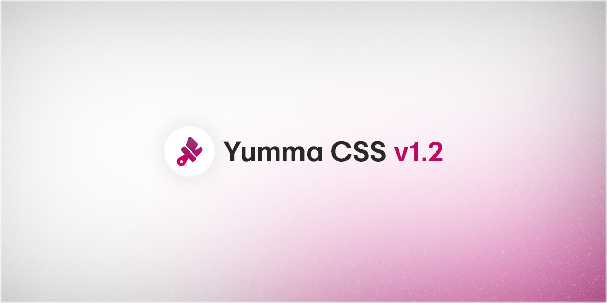

import YmaUtility from '@site/src/components/YmaUtility/YmaUtility';
import YmaPalette from "@site/src/components/YmaPalette/YmaPalette";
import YmaPreview from '@site/src/components/YmaPreview/YmaPreview';

import Tabs from '@theme/Tabs';
import TabItem from '@theme/TabItem';

For a long time I haven't updated the color palette of Yumma CSS, so today I'm very proud to announce [Yumma CSS v1.2.0](https://github.com/yumma-lib/yumma-css/releases/tag/v1.2.0), which introduces a reworked color palette, adds new variations for dimension classes, line height classes and much more.

{/* truncate */}



## What's new in Yumma 1.2.0?

You may also want to take a look at some of the [release notes](https://github.com/yumma-lib/yumma-css/releases/tag/v1.2.0) but anyway, these are the most noticeable shifts:

- [x] **[All new utilities](#all-new-utilities):** Heights, Widths, Flex, Box Shadow and Line Height.

- [x] **[New color palette](#new-color-palette):** New palette with more vivid colors.

- [x] **[Extending media queries](#extending-media-queries):** Dimension utility class media query extension.

- [x] **[Button style](#button-style):** Button styling improvements.

This is an incremental update that may contain bug fixes. Minor releases follow [semantic versioning](https://docs.npmjs.com/about-semantic-versioning) conventions. In other words, this should be an easy update for you.

---

### All new utilities 

After some time without new utility classes for **Height** (max and min height), **Width** (max and min width) and **Dimension** (max and min), here it is — `fit-content`.

<YmaUtility
  classData={[
    {
      className: 'h-fc',
      properties: [
        'height: fit-content;'
      ]
    },
    {
      className: 'w-fc',
      properties: [
        'width: fit-content;'
      ]
    },
    {
      className: 'max-h-fc',
      properties: [
        'max-height: fit-content;'
      ]
    },
    {
      className: 'min-h-fc',
      properties: [
        'max-height: fit-content;'
      ]
    },
    {
      className: 'max-w-*',
      properties: [
        'max-width: fit-content;'
      ]
    },
    {
      className: 'min-w-*',
      properties: [
        'max-width: fit-content;'
      ]
    },
    {
      className: 'dim-1',
      properties: [
        'height: 0.25rem;',
        'width: 0.25rem;'
      ]
    },
    {
      className: 'max-dim-1',
      properties: [
        'max-height: 0.25rem;',
        'max-width: 0.25rem;'
      ]
    },
    {
      className: 'min-dim-1',
      properties: [
        'min-height: 0.25rem;',
        'min-width: 0.25rem;'
      ]
    },
  ]}
/>

I'm also extend the **Flex** class even further, now with three new utilities: `auto`, `full` and `half`.

<YmaUtility
  classData={[
    {
      className: 'f-auto',
      properties: [
        'flex: auto;'
      ]
    },
    {
      className: 'f-full',
      properties: [
        'flex: 100%;'
      ]
    },
    {
      className: 'f-half',
      properties: [
        'flex: 50%;'
      ]
    },
  ]}
/>

Well, better late than never, Yumma CSS will now make texts a bit more different thanks to new classes for text height. There are still a few things to improve, but for now it's a good start.

```html
<p class="lh-6 t-l-gray-2">In an endless white expanse, Ren stood by a solitary tree ...</p>
```

<YmaPreview
  codeData = {`<p class="lh-6 t-l-gray-2">In an endless white expanse, Ren stood by a solitary tree. Above him, souls streaked like comets, fleeting and swift. The world, pure white, offered only fleeting motion. In the midst of longing, Ren found a quiet surrender, waiting in timeless silence. Each soul's trajectory told a unique story of its journey. Some soared gracefully, while others spiraled with wild exuberance. The lone tree beside him seemed to share Ren's vigil, its branches reaching skyward.</p>`}
  usePadding
  useVersion = '1.2.0'
/>

---

### New color palette

You've probably seen these colors in [Tailwind CSS](https://tailwindcss.com/), and I'm a big fan of their style. Since the first version of Yumma CSS, I've always used the Photoshop palette variations, but there was one problem. Contrast. So I decided to create a variation based on Tailwind by replacing Aqua with Cyan and Magenta with Indigo.

<YmaPalette
  colorData={[
    {
      name: 'Cyan',
      color: '#3575dd'
    },
    {
      name: 'Indigo',
      color: '#595cd9'
    }
  ]}
/>

Previously, the colors weren't as rich as I wanted them to be, and this was a limitation because colors with less contrast can go unnoticed in many scenarios. Here's a comparison between the old and new color palettes in Yumma CSS v1.2.

<Tabs>
  <TabItem value="now" label="Now">
    <YmaPalette
      colorData={[
        {
          name: 'Blue',
          color: '#3575dd'
        }
      ]}
    />
  </TabItem>
  <TabItem value="then" label="Then">
    <YmaPalette
      colorData={[
        {
          name: 'Blue',
          color: '#438cca'
        }
      ]}
    />
  </TabItem>
</Tabs>

Oh, another thing, though it's not a color, Yumma CSS v1.2 now supports — `transparent`.

---

### Extending media queries

Slowly, Yumma CSS will overcome this responsive limitation, but for now, let's focus on the present. I've added media queries for the `.dim-{}`, `.max-dim-{}` and `.min-dim-{}` classes.

---

### Button style

This new change will make the content on the button much easier to read, as the dimensions have been changed to be slightly smaller to make the text stand out more.

<Tabs>
  <TabItem value="now" label="Now">
    <YmaPreview
      codeData = {`<div class="ins h-1/1">
          <button class="btn-pink t-white">Button</button>
        </div>
      `}
      useVersion = '1.2.0'
    />
  </TabItem>
  <TabItem value="then" label="Then">
    <YmaPreview
      codeData = {`<div class="ins h-1/1">
          <button class="btn-pink t-white">Button</button>
        </div>
      `}
      useVersion = '1.1.0'
    />
  </TabItem>
</Tabs>

---

## Upgrade

You can upgrade your projects by getting the latest version of `yummacss` from npm:

```bash
npm install yummacss@latest
```