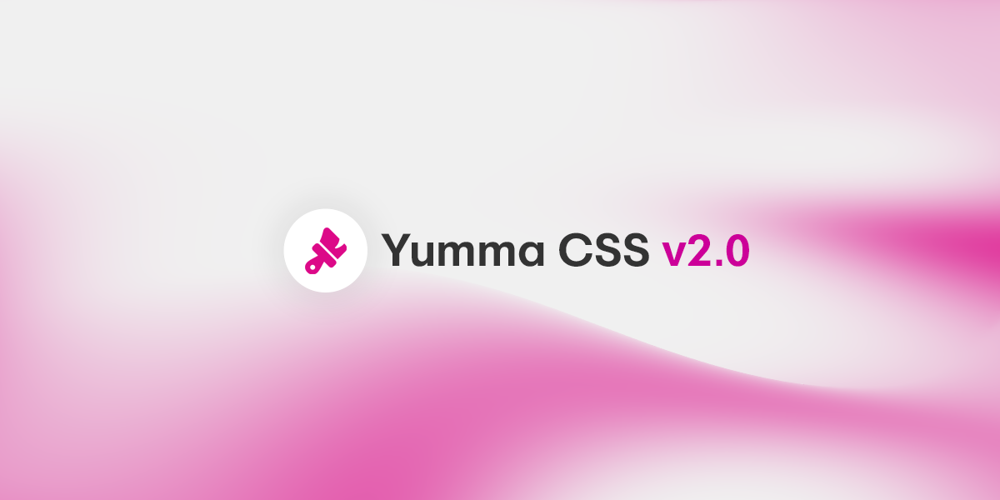

import Tabs from '@theme/Tabs';
import TabItem from '@theme/TabItem';

import Color from '@site/src/components/Color/Color';
import Palette from "@site/src/components/Palette/Palette";
import Preview from '@site/src/components/Preview/Preview';
import Utility from '@site/src/components/Utility/Utility';

Yup, it's happening again! Today, I'm super jazzed to announce [Yumma CSS v2.0.0](https://github.com/yumma-lib/yumma-css/releases/tag/v2.0.0). This new update is packed with an extensive set of new utilities, major improvements, redesigned source code and of course some important fixes.

{/* truncate */}



## What's new in Yumma 2.0.0?

You may also want to take a look at some of the [release notes](https://github.com/yumma-lib/yumma-css/releases/tag/v2.0.0) but anyway, these are the most noticeable shifts:

- **[All new utilities](#all-new-utilities):** Color utilities, Gap, Spacing, and much more

- **[Base styles](#base-styles):** Base styles is now optional

- **[Responsive breakpoints](#responsive-breakpoints):** Media query utilities support extended

- **[Container rules](#container-rules):** New container utility rules

This is a major update that introduces groundbreaking features. Major releases follow [semantic versioning](https://docs.npmjs.com/about-semantic-versioning) conventions. In other words, you probably need refactoring after upgrading.

---

### All new utilities

In each new major release, I consistently introduce new customization utilities. This latest release is no exception, as it introduces the **Accent Color** utilities.

<Color 
  classPrefix="ac-" 
  classValues={['accent-color']} 
  data={[
    { color: 'red', value: '#d73d3d' },
    { color: 'orange', value: '#e06814' },
    { color: 'yellow', value: '#d3a107' },
    { color: 'green', value: '#1fb155' },
    { color: 'teal', value: '#12a695' },
    { color: 'cyan', value: '#05a4bf' },
    { color: 'blue', value: '#3575dd' },
    { color: 'indigo', value: '#595cd9' },
    { color: 'violet', value: '#7d53dd' },
    { color: 'pink', value: '#d4418a' },
    { color: 'gray', value: '#606773' },
    { color: 'lead', value: '#3f3f4e' }
  ]}
/>

The **Aspect Ratio** is a valuable addition, particularly for image elements.

<Utility
  data={[
    {
      className: 'ar-s',
      properties: [
        'aspect-ratio: 1/1;'
      ]
    },
    {
      className: 'ar-l',
      properties: [
        'aspect-ratio: 16/9;'
      ]
    },
    {
      className: 'ar-auto',
      properties: [
        'aspect-ratio: auto;'
      ]
    }
  ]}
/>

You can now apply cool effects to your components thanks to the **Backdrop Filter** utilities.

<Utility
  data={[
    {
      className: 'bf-b-none',
      properties: [
        'backdrop-filter: blur(0px);'
      ]
    },
    {
      className: 'bf-b-xs',
      properties: [
        'backdrop-filter: blur(4px);'
      ]
    },
    {
      className: 'bf-b-sm',
      properties: [
        'backdrop-filter: blur(8px);'
      ]
    },
    {
      className: 'bf-b-md',
      properties: [
        'backdrop-filter: blur(16px);'
      ]
    },
    {
      className: 'bf-b-lg',
      properties: [
        'backdrop-filter: blur(32px);'
      ]
    },
    {
      className: 'bf-b-xl',
      properties: [
        'backdrop-filter: blur(64px);'
      ]
    }
  ]}
/>

I'm finally adding the **Border Collapse** utilities to create better tables in your site with Yumma CSS.

<Utility
  data={[
    {
      className: 'bc-c',
      properties: [
        'border-collapse: collapse;'
      ]
    },
    {
      className: 'bc-s',
      properties: [
        'border-collapse: separate;'
      ]
    }
  ]}
/>

The recently introduced **Border Style** utilities offer the ability to alter the formatting of underlines applied to elements.

<Utility
  data={[
    {
      className: 'b-none',
      properties: [
        'border-style: none;'
      ]
    },
    {
      className: 'b-d',
      properties: [
        'border-style: dashed;'
      ]
    },
    {
      className: 'b-h',
      properties: [
        'border-style: hidden;'
      ]
    },
    {
      className: 'b-s',
      properties: [
        'border-style: solid;'
      ]
    }
  ]}
/>

I'm also implementing utilities for Tables elements like **Caption Side**.

<Utility
  data={[
    {
      className: 'cs-b',
      properties: [
        'caption-side: bottom;'
      ]
    },
    {
      className: 'cs-t',
      properties: [
        'caption-side: top;'
      ]
    }
  ]}
/>

You can now change the color of SVG elements with Yumm CSS 2.0 using the new **Fill** color utilities.

<Color 
  classPrefix="f-" 
  classValues={['fill']} 
  data={[
    { color: 'red', value: '#d73d3d' },
    { color: 'orange', value: '#e06814' },
    { color: 'yellow', value: '#d3a107' },
    { color: 'green', value: '#1fb155' },
    { color: 'teal', value: '#12a695' },
    { color: 'cyan', value: '#05a4bf' },
    { color: 'blue', value: '#3575dd' },
    { color: 'indigo', value: '#595cd9' },
    { color: 'violet', value: '#7d53dd' },
    { color: 'pink', value: '#d4418a' },
    { color: 'gray', value: '#606773' },
    { color: 'lead', value: '#3f3f4e' }
  ]}
/>

In Yumma CSS 2.0, modifications has been made to the **Container** utility class, with the introduction of new default breakpoint rules.

<Utility
  data={[
    {
      className: 'cnt',
      properties: [
        'width: 100%;', 'max-width: 640px;', 'max-width: 768px;', 'max-width: 1024px;', 'max-width: 1280px;'
      ]
    }
  ]}
/>

It is now possible to modify the **Font Style** of text elements within the specified themes.

<Utility
  data={[
    {
      className: 'fs-i',
      properties: [
        'font-style: italic;'
      ]
    },
    {
      className: 'fs-n',
      properties: [
        'font-style: normal;'
      ]
    }
  ]}
/>

The **Gap** utilities aren't necessarily new, but they are different, in older versions we had [Offset Gaps](/docs/1.2.0/responsive-design#offset-gap) and they were intended strictly for responsive layouts and not for adding gaps between elements. In Yumma CSS v2.0 this won't be the case anymore.

<Utility
  data={[
    {
      className: 'g-1',
      properties: [
        'gap: 0.25rem;'
      ]
    },
    {
      className: 'g-2',
      properties: [
        'gap: 0.5rem;'
      ]
    },
    {
      className: 'g-3',
      properties: [
        'gap: 0.75rem;'
      ]
    },
    {
      className: 'g-4',
      properties: [
        'gap: 1rem;'
      ]
    },
    {
      className: 'g-5',
      properties: [
        'gap: 1.25rem;'
      ]
    },
    {
      className: 'g-6',
      properties: [
        'gap: 1.5rem;'
      ]
    },
    {
      className: 'g-7',
      properties: [
        'gap: 1.75rem;'
      ]
    },
    {
      className: 'g-8',
      properties: [
        'gap: 2rem;'
      ]
    },
    {
      className: 'g-9',
      properties: [
        'gap: 2.25rem;'
      ]
    },
    {
      className: 'g-10',
      properties: [
        'gap: 2.5rem;'
      ]
    },
    {
      className: 'g-11',
      properties: [
        'gap: 2.75rem;'
      ]
    },
    {
      className: 'g-12',
      properties: [
        'gap: 3rem;'
      ]
    },
    {
      className: 'g-13',
      properties: [
        'gap: 3.25rem;'
      ]
    },
    {
      className: 'g-14',
      properties: [
        'gap: 3.5rem;'
      ]
    },
    {
      className: 'g-15',
      properties: [
        'gap: 3.75rem;'
      ]
    },
    {
      className: 'g-16',
      properties: [
        'gap: 4rem;'
      ]
    }
  ]}
/>

I'm also including **Object Fit** and **Object Position** utility classes.

**Object Fit**

<Utility
  data={[
    {
      className: 'of-c',
      properties: [
        'object-fit: cover;'
      ]
    },
    {
      className: 'of-f',
      properties: [
        'object-fit: fill;'
      ]
    },
    
    {
      className: 'of-none',
      properties: [
        'object-fit: none;'
      ]
    },
    {
      className: 'of-sd',
      properties: [
        'object-fit: scale-down;'
      ]
    }
  ]}
/>

**Object Position**

<Utility
  data={[
    {
      className: 'op-b',
      properties: [
        'object-position: bottom;'
      ]
    },
    {
      className: 'op-c',
      properties: [
        'object-position: center;'
      ]
    },
    {
      className: 'op-lb',
      properties: [
        'object-position: left bottom;'
      ]
    },
    {
      className: 'op-left',
      properties: [
        'object-position: left;'
      ]
    },
    {
      className: 'op-lt',
      properties: [
        'object-position: left top;'
      ]
    },
    {
      className: 'op-r',
      properties: [
        'object-position: right;'
      ]
    },
    {
      className: 'op-rb',
      properties: [
        'object-position: right bottom;'
      ]
    },
    {
      className: 'op-rt',
      properties: [
        'object-position: right top;'
      ]
    },
    {
      className: 'op-t',
      properties: [
        'object-position: top;'
      ]
    }
  ]}
/>

In addition to the previously discussed customization utilities, Yumma CSS 2.0 also includes **Outline Color**, **Outline Offset**, **Outline Style** and **Outline Width** utility classes.

**Outline Color**

<Color 
  classPrefix="oc-" 
  classValues={['outline-color']} 
  data={[
    { color: 'red', value: '#d73d3d' },
    { color: 'orange', value: '#e06814' },
    { color: 'yellow', value: '#d3a107' },
    { color: 'green', value: '#1fb155' },
    { color: 'teal', value: '#12a695' },
    { color: 'cyan', value: '#05a4bf' },
    { color: 'blue', value: '#3575dd' },
    { color: 'indigo', value: '#595cd9' },
    { color: 'violet', value: '#7d53dd' },
    { color: 'pink', value: '#d4418a' },
    { color: 'gray', value: '#606773' },
    { color: 'lead', value: '#3f3f4e' }
  ]}
/>

**Outline Offset**

<Utility
  data={[
    {
      className: 'oo-0',
      properties: [
        'outline-offset: 0px;'
      ]
    },
    {
      className: 'oo-1',
      properties: [
        'outline-offset: 4px;'
      ]
    },
    {
      className: 'oo-2',
      properties: [
        'outline-offset: 8px;'
      ]
    },
    {
      className: 'oo-3',
      properties: [
        'outline-offset: 12px;'
      ]
    },
    {
      className: 'oo-4',
      properties: [
        'outline-offset: 16px;'
      ]
    }
  ]}
/>

**Outline Style**

<Utility
  data={[
    {
      className: 'os-none',
      properties: [
        'outline-style: none;'
      ]
    },
    {
      className: 'os-d',
      properties: [
        'outline-style: dashed;'
      ]
    },
    {
      className: 'os-h',
      properties: [
        'outline-style: hidden;'
      ]
    },
    {
      className: 'os-s',
      properties: [
        'outline-style: solid;'
      ]
    }
  ]}
/>

**Outline Width**

<Utility
  data={[
    {
      className: 'ow-0',
      properties: [
        'outline-width: 0px;'
      ]
    },
    {
      className: 'ow-1',
      properties: [
        'outline-width: 4px;'
      ]
    },
    {
      className: 'ow-2',
      properties: [
        'outline-width: 8px;'
      ]
    },
    {
      className: 'ow-3',
      properties: [
        'outline-width: 12px;'
      ]
    },
    {
      className: 'ow-4',
      properties: [
        'outline-width: 16px;'
      ]
    }
  ]}
/>

Yumma CSS 2.0 features the addition of **Spacing** utilities just like [Tailwind CSS](https://tailwindcss.com/docs/space). These utilities employ a distinct syntax, which is designed to facilitate the separation of elements within the main container. The utilization of these utilities can potentially result in the reduction of CSS code, which is a beneficial outcome.

**Spacing X**

<Utility 
  classPrefix='s-x-' 
  classValues={['margin-left', 'margin-right']}
  range={100} 
  increment={0.25} 
  unit='rem'
/>

**Spacing Y**

<Utility 
  classPrefix='s-y-' 
  classValues={['margin-top', 'margin-bottom']} 
  range={100} 
  increment={0.25} 
  unit='rem' 
/>

It would be remiss of me not to mention the new table utilities without also mentioning the **Table Layout** utility classes.

<Utility
  data={[
    {
      className: 'tl-auto',
      properties: [
        'table-layout: auto;'
      ]
    },
    {
      className: 'tl-f',
      properties: [
        'table-layout: fixed;'
      ]
    }
  ]}
/>

In conclusion, the latest version of Yumma CSS 2.0 introduces a series of new utility classes specifically designed for text formatting. These include **Text Decoration Color**, **Text Decoration Style**, and **Text Decoration Thickness**.

**Text Decoration Color**

<Color 
  classPrefix="tdc-" 
  classValues={['outline-color']} 
  data={[
    { color: 'red', value: '#d73d3d' },
    { color: 'orange', value: '#e06814' },
    { color: 'yellow', value: '#d3a107' },
    { color: 'green', value: '#1fb155' },
    { color: 'teal', value: '#12a695' },
    { color: 'cyan', value: '#05a4bf' },
    { color: 'blue', value: '#3575dd' },
    { color: 'indigo', value: '#595cd9' },
    { color: 'violet', value: '#7d53dd' },
    { color: 'pink', value: '#d4418a' },
    { color: 'gray', value: '#606773' },
    { color: 'lead', value: '#3f3f4e' }
  ]}
/>

**Text Decoration Style**

<Utility
  data={[
    {
      className: 'tds-none',
      properties: [
        'text-decoration-style: none;'
      ]
    },
    {
      className: 'tds-d',
      properties: [
        'text-decoration-style: dashed;'
      ]
    },
    {
      className: 'tds-h',
      properties: [
        'text-decoration-style: hidden;'
      ]
    },
    {
      className: 'tds-s',
      properties: [
        'text-decoration-style: solid;'
      ]
    }
  ]}
/>

**Text Decoration Thickness**

<Utility
  data={[
    {
      className: 'tdt-auto',
      properties: [
        'text-decoration-thickness: auto;'
      ]
    },
    {
      className: 'tdt-ff',
      properties: [
        'text-decoration-thickness: from-font;'
      ]
    },
    {
      className: 'tdt-0',
      properties: [
        'text-decoration-thickness: 0px;'
      ]
    },
    {
      className: 'tdt-1',
      properties: [
        'text-decoration-thickness: 4px;'
      ]
    },
    {
      className: 'tdt-2',
      properties: [
        'text-decoration-thickness: 8px;'
      ]
    },
    {
      className: 'tdt-3',
      properties: [
        'text-decoration-thickness: 12px;'
      ]
    },
    {
      className: 'tdt-4',
      properties: [
        'text-decoration-thickness: 16px;'
      ]
    }
  ]}
/>

### Base styles

You can now use Yumma CSS without the default base styles, this might be helpful if you want to set specific rules in your theme.

Standard

```html
<link href="https://cdn.jsdelivr.net/gh/yumma-lib/yumma-css@2.0.0/dist/yumma-core.css" rel="stylesheet" crossorigin="anonymous">
```

Minified

```html
<link href="https://cdn.jsdelivr.net/gh/yumma-lib/yumma-css@2.0.0/dist/yumma-core.min.css" rel="stylesheet" crossorigin="anonymous">
```

### Responsive breakpoints

Took me long me long enough, but I'm finally adding full media query support for every single utility class. 

```html
<div class="cnt mx-auto p-4">
  <!-- highlight-start -->
  <div class="d-g gtc-1 sm:gtc-2 md:gtc-3 lg:gtc-4 g-4">
    <!-- highlight-end -->
    <div class="..."></div>
    <div class="..."></div>
    <div class="..."></div>
  </div>
</div>
```

Yumma CSS will also change the way breakpoint behaves in your browser.

<Tabs>
  <TabItem value="now" label="Now">
    <Utility
        data={[
          { className: 'sm', properties: ['min-width: 640px'] },
          { className: 'md', properties: ['min-width: 768px'] },
          { className: 'lg', properties: ['min-width: 1024px'] },
          { className: 'xl', properties: ['min-width: 1280px'] },
        ]}
    />
  </TabItem>
  <TabItem value="then" label="Then">
    <Utility
        data={[
          { className: 'xs', properties: ['min-width: 0'] },
          { className: 'sm', properties: ['min-width: 480px'] },
          { className: 'md', properties: ['min-width: 720px'] },
          { className: 'lg', properties: ['min-width: 960px'] },
          { className: 'xl', properties: ['min-width: 1200px'] },
        ]}
    />
  </TabItem>
</Tabs>

### Container rules

The container utility is completely redesigned in this new update, starting with the new class name `ctn`, the new container will now have a set of media query rules to ensure responsiveness in your theme.

<Tabs>
  <TabItem value="now" label="Now">
    ```scss
    .cnt {
      width: 100%;
      @each $bp, $bp_value in $yma-breakpoints {
        @include breakpoint($bp_value) {
        max-width: $bp_value;
        }
      }
    }
    ```
  </TabItem>
  <TabItem value="then" label="Then">
    ```scss
    .cnn {
      width: 100%;
      max-width: 1200px;
      margin: 0 auto;
      padding: 0 20px;
      box-sizing: border-box;
    }
    ```
  </TabItem>
</Tabs>

---

## Upgrade

You can upgrade your projects by getting the latest version of `yummacss` from npm:

```bash
npm install yummacss@latest
```