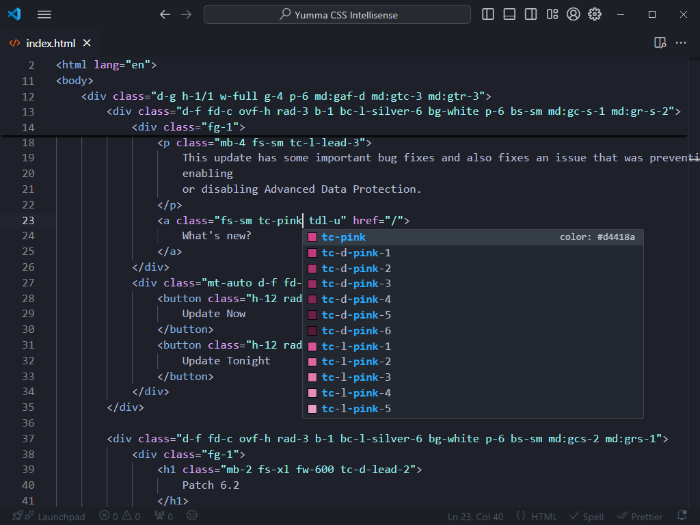
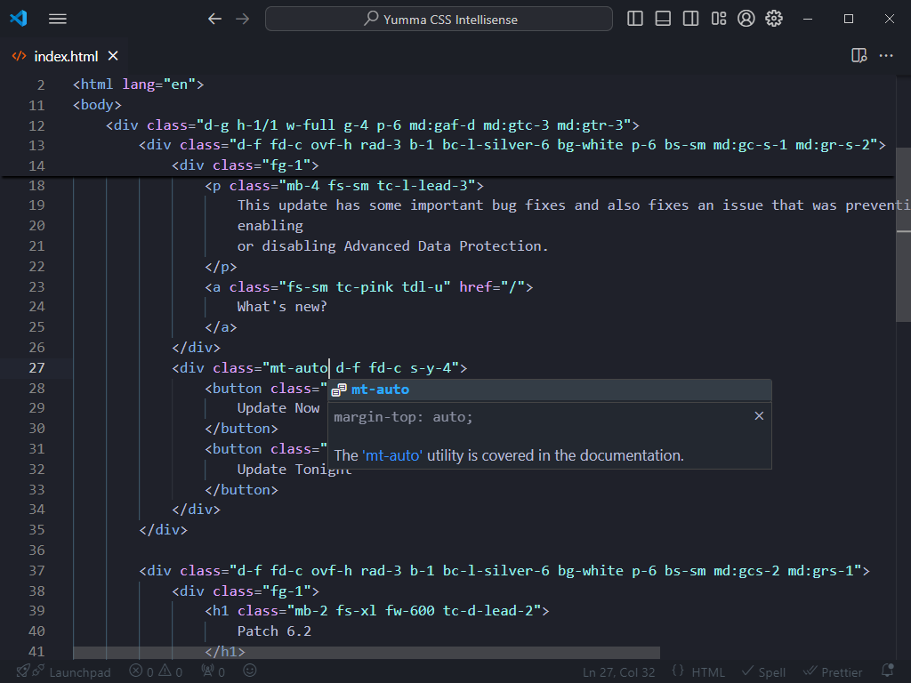
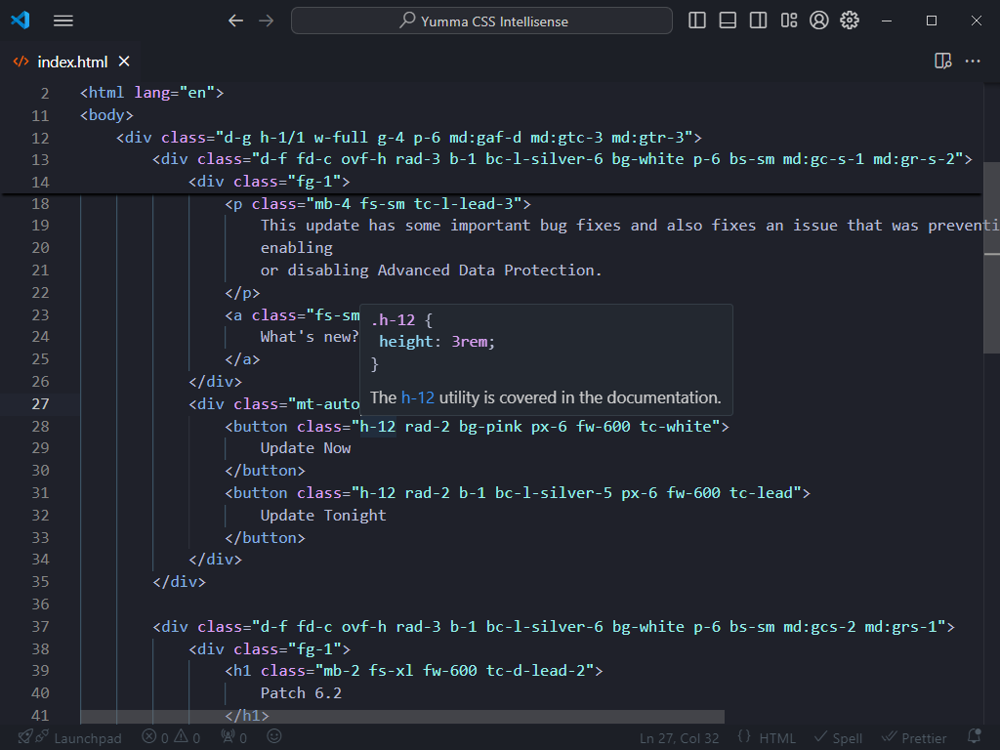

import { ShowcaseText } from "starlight-showcases";

Today, I'm very pleased to announce the arrival of the [Yumma CSS Intellisense extension for Visual Studio Code](https://marketplace.visualstudio.com/items?itemName=yumma-css.yumma-css-intellisense), designed by developers for developers to improve productivity and make creating applications or websites easier and more enjoyable.

## What's in the box?

Here it is some features packaged with the extension:

- **Completions:** Helpful completions that can be accessed while typing.
- **Documentation**: Provides users with the opportunity to learn more about each completion.
- **Hovering:** Inspect the CSS behind the Yumma CSS classes.

Get [Yumma CSS Intellisense from the Visual Studio Marketplace](https://marketplace.visualstudio.com/items?itemName=yumma-css.yumma-css-intellisense).

:::note
You'll need to install Yumma CSS in your project to get Yumma CSS Intellisense up and running.
:::

---

### Completions

Get suggestions as you type, with information about their CSS properties and previews of the colors.

### Documentation

Take a closer look at the documentation with these helpful links.

### Hovering

Move your cursor over the name of a class to see each of its CSS properties.

## Community

Join the Yumma CSS community! Share your experiences and help Yumma CSS grow and be the best it can be.

<ShowcaseText
  entries={[
    {
      description:
        "If you experience any problems, please notify us at GitHub.",
      href: "https://github.com/yumma-lib/yumma-css/issues",
      title: "GitHub",
    },
    {
      description: "Join our Discord for discussion, sharing, and learning.",
      href: "https://discord.gg/2MUw2g6FCn",
      title: "Discord",
    },
    {
      description: "Please follow us on Twitter to receive the latest updates.",
      href: "https://twitter.com/yummacss",
      title: "Twitter",
    },
    {
      description: "Watch our screencasts on YouTube for the latest updates.",
      href: "https://youtube.com/@yummacss",
      title: "YouTube",
    },
  ]}
/>
