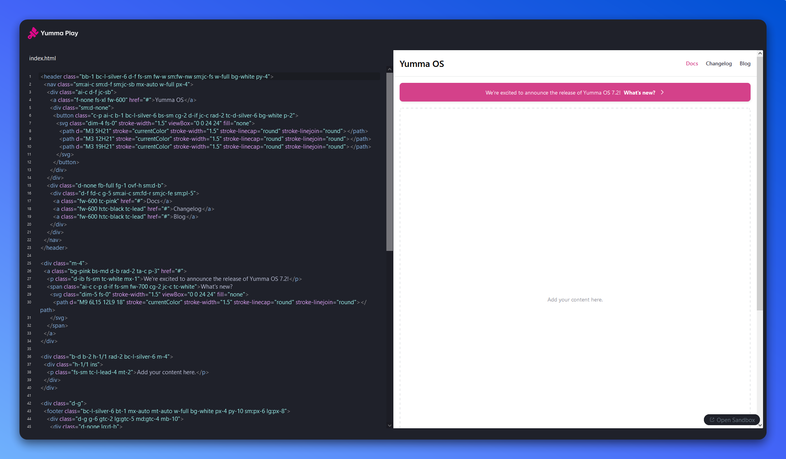
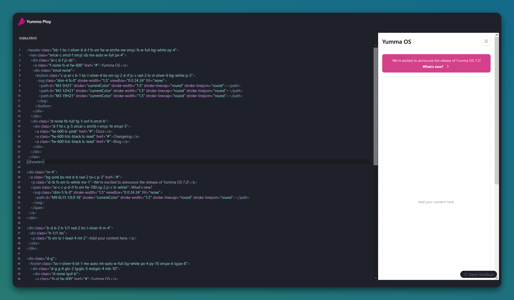
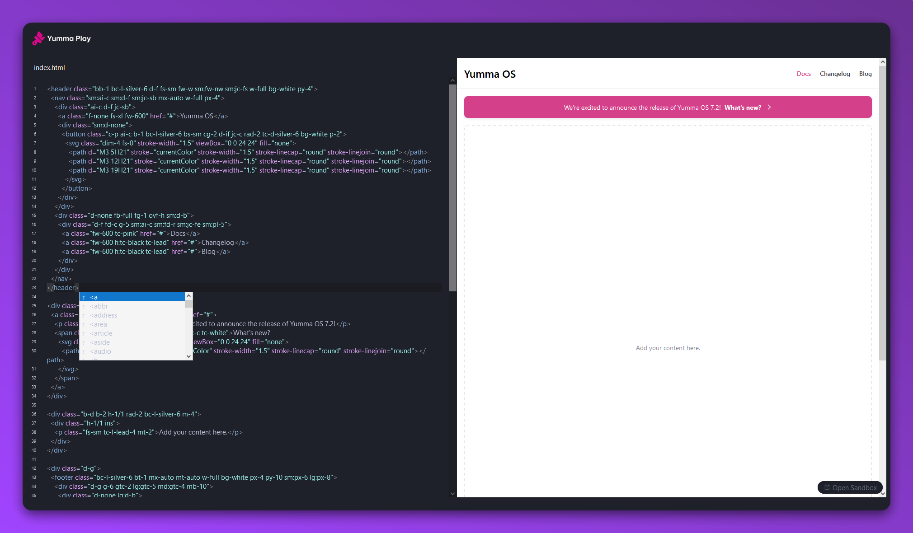

I'm super jazzed to announce [Yumma CSS Play](https://play.yummacss.com)! It's a code editor on the web with Yumma CSS built in, so you can create your own Yumma CSS components and see them in action right away.

### What's in the box?

Here it is some features packaged with the extension:

- **Responsiveness**: Test responsiveness by resizing the preview panel.
- **Zero Configuration**: Just write some Yumma CSS, it's already installed!
- **Completions**: Helpful HTML tag completions.

Yumma CSS Play is powered by [Sandpack](https://codemirror.net/), a code editor component for the web.

---

### Zero Configuration

All you have to do is write some Yumma CSS — it's already installed!

### Responsiveness

To test how responsive it is, just resize the preview panel.

### Completions

Get some helpful tips on using semantic HTML tags when you're writing.

### Community

Join the Yumma CSS community! Share your experiences and help Yumma CSS grow and be the best it can be.

<ShowcaseText
  entries={[
    {
      description:
        "If you experience any problems, please notify us at GitHub.",
      href: "https://github.com/yumma-lib/yumma-css/issues",
      title: "GitHub",
    },
    {
      description: "Join our Discord for discussion, sharing, and learning.",
      href: "https://discord.gg/2MUw2g6FCn",
      title: "Discord",
    },
    {
      description: "Please follow us on Twitter to receive the latest updates.",
      href: "https://twitter.com/yummacss",
      title: "Twitter",
    },
    {
      description: "Watch our screencasts on YouTube for the latest updates.",
      href: "https://youtube.com/@yummacss",
      title: "YouTube",
    },
  ]}
/>
